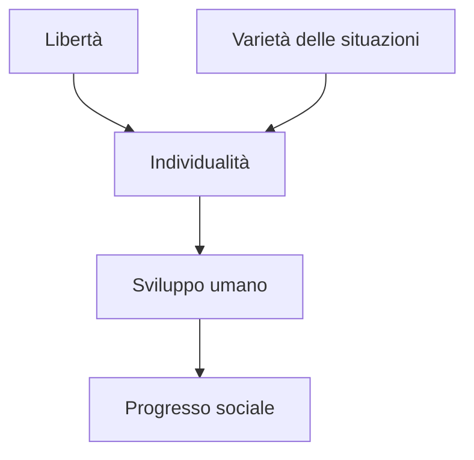

**Wilhelm von Humboldt** (1767–1835), citato da Mill come *Guglielmo di Humboldt*, è una delle autorità filosofiche più frequentemente invocate nel *Saggio sulla Libertà*. Mill lo presenta come il pensatore che ha formulato con la massima chiarezza il principio che l'**individualità** — lo sviluppo libero e multiforme della personalità umana — è il vero fine dell'esistenza. La dottrina humboldtiana della *Bildung* (formazione integrale dell'individuo) percorre come un filo rosso l'intero Capitolo III del *Saggio*.

## Humboldt nel Saggio

Mill cita Humboldt in sei punti nevralgici del *Saggio*, dalla Prefazione alle Note finali. La prima menzione, nella sezione introduttiva su Giovanni Stuart Mill, lo colloca immediatamente tra le fonti ispiratrici:

> Della sfera d'azione e dei doveri del Governo (P03-012)

Ma è nel Capitolo III — il cuore normativo dell'opera — che Humboldt diventa l'autorità decisiva:

> La dottrina sulla quale Guglielmo Humboldt, uomo così notevole e come erudito e come uomo politico, fondò il suo argomento (003-005)

## I Due Pilastri della Dottrina Humboldtiana

Mill riassume il pensiero di Humboldt in due **condizioni necessarie** per lo sviluppo umano, che egli fa proprie:

> Guglielmo di Humboldt indicò due cose come condizioni necessarie dello sviluppo umano: la libertà e la varietà delle situazioni (003-047)

Queste due condizioni — **libertà** e **varietà** — costituiscono l'ossatura argomentativa del Capitolo III:

| Condizione | Significato | Conseguenza della sua Assenza |
|-----------|-------------|------------------------------|
| Libertà | Possibilità di scegliere il proprio piano di vita | L'individuo diventa una macchina copiatrice |
| Varietà delle situazioni | Diversità di circostanze e di esperienze | L'originalità si spegne |

## Humboldt e l'Educazione

Nel Capitolo V, Mill si appoggia a Humboldt per argomentare **contro l'istruzione controllata dallo Stato**:

> Il barone di Humboldt, nell'opera eccellente che ho già citato, sostiene che l'istruzione pubblica debba limitarsi a esami pubblici (005-018)

Humboldt argomentava — e Mill concorda — che lo Stato non debba monopolizzare l'educazione. Il controllo statale dell'istruzione rischia di produrre **uniformità** anziché favorire quella diversità di caratteri e di talenti che è la ricchezza di una società libera:

> Ed io penso con Guglielmo di Humboldt che i gradi o gli altri certificati di studi non debbano essere conferiti dallo Stato (005-030)

## L'Eredità Humboldtiana in Mill

L'influenza di Humboldt su Mill va oltre le citazioni esplicite. La struttura stessa del *Saggio* riflette la gerarchia humboldtiana dei valori:

Il principio humboldtiano — che **il fine dell'uomo è lo sviluppo più alto e armonioso delle sue facoltà** — diventa in Mill il fondamento di una filosofia politica che antepone la fioritura individuale a qualsiasi considerazione di utilità aggregata.

## Humboldt e la Critica allo Stato Interventista

L'ultima citazione di Humboldt — nelle *Note* finali del *Saggio* — riguarda i limiti dell'intervento statale:

> Dei limiti dell'azione e dei doveri del Governo, di Guglielmo Humboldt (006-008)

Mill cita l'opera humboldtiana *Ideen zu einem Versuch, die Grenzen der Wirksamkeit des Staats zu bestimmen* (Idee per un tentativo di determinare i limiti dell'azione dello Stato) come l'espressione più compiuta del principio che lo Stato deve **limitarsi a garantire la sicurezza** e astenersi dal plasmare i cittadini secondo un modello uniforme.

## Rilevanza Filosofica

Humboldt rappresenta nel *Saggio* più di una semplice autorità erudita. Egli incarna una **tradizione alternativa** di liberalismo — non utilitaristica, non contrattualistica — fondata sul valore intrinseco dello sviluppo individuale. Mill, che per formazione era benthamiano, trova in Humboldt la giustificazione filosofica per un liberalismo che non si riduce al calcolo della felicità aggregata ma riconosce la **qualità** della vita umana come criterio autonomo.

## Collegamenti

- [[individualita]] — Il concetto milliano che Humboldt ha direttamente ispirato
- [[originalita]] — La virtù humboldtiana della non-conformità
- [[costume]] — Il nemico della varietà humboldtiana
- [[genio]] — L'incarnazione più alta dell'ideale humboldtiano
- [[governo]] — Ciò che Humboldt vuole limitare
- [[liberta]] — Il primo pilastro humboldtiano

::: seealso
- [[alexis-de-tocqueville]] — Altro pensatore della libertà citato da Mill
- [[liberta-di-pensiero]] — L'applicazione intellettuale del principio humboldtiano
- [[stato]] — L'entità i cui limiti Humboldt ha cercato di definire
